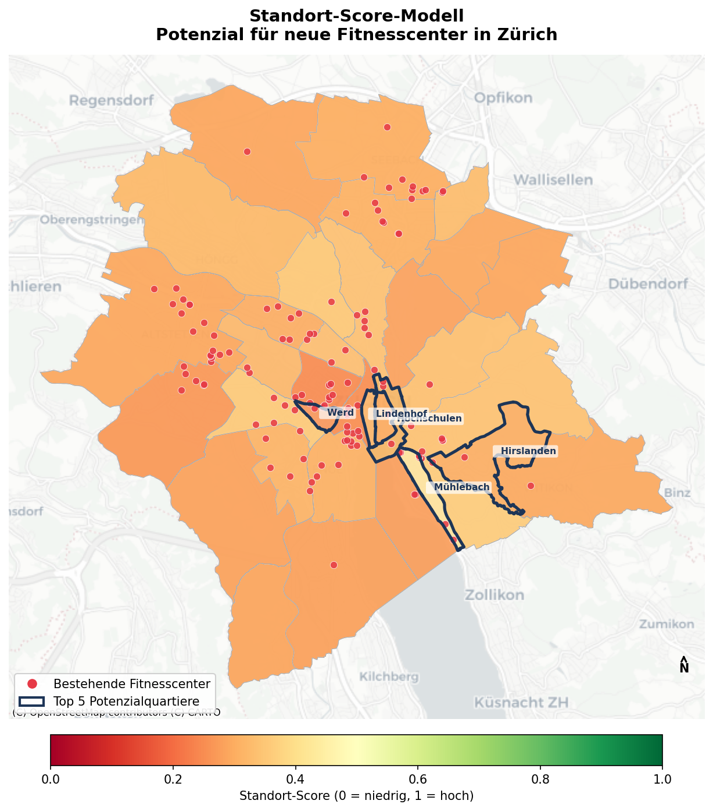
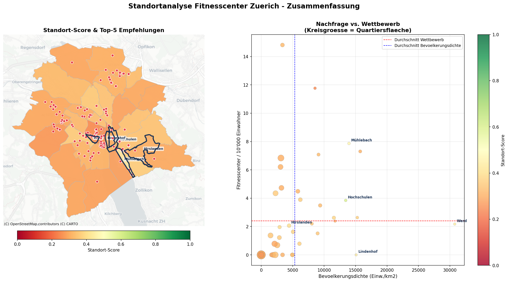
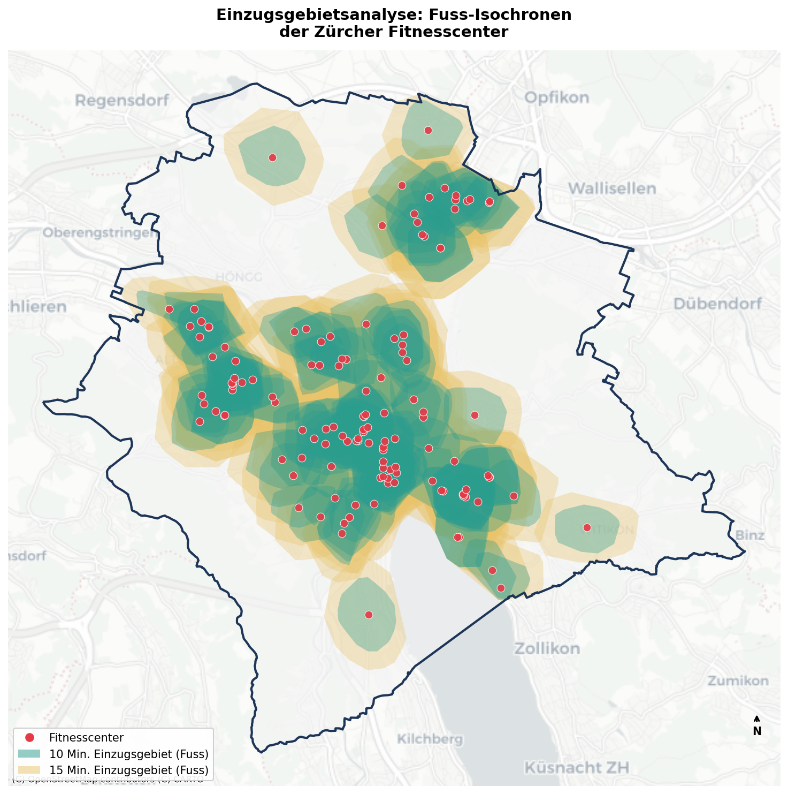
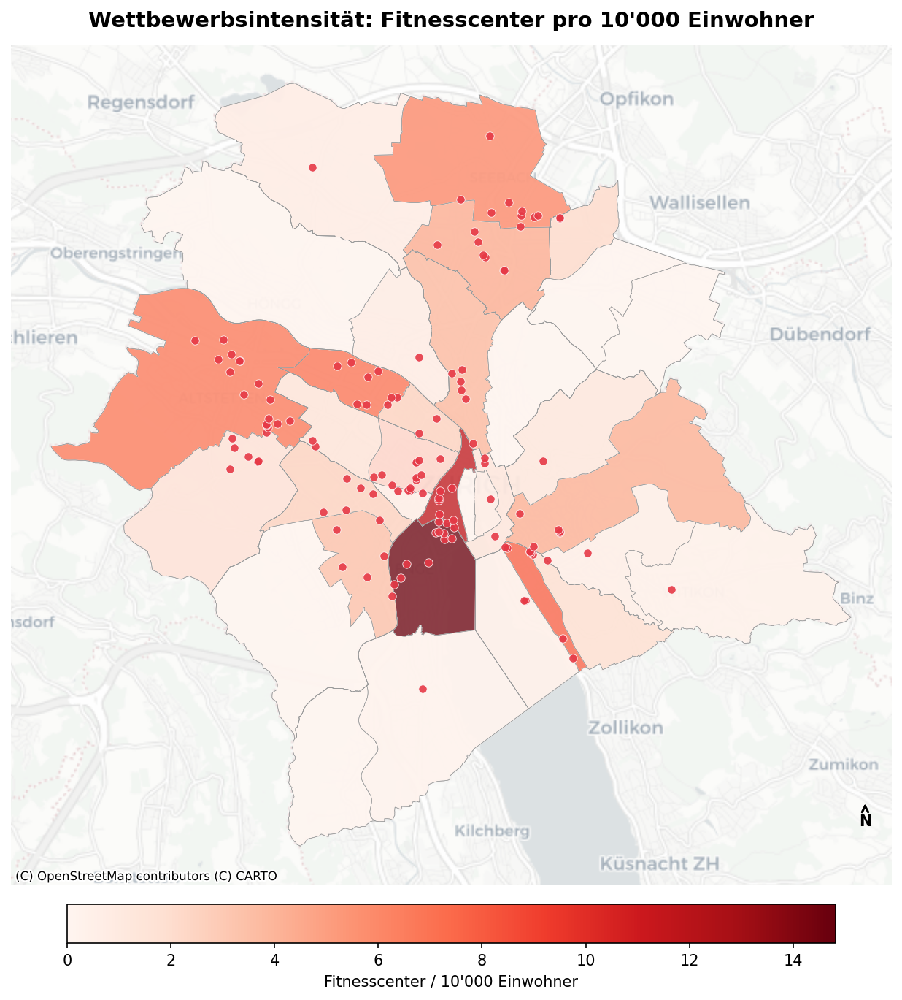

# 📍 Standortanalyse für Fitnesscenter in der Stadt Zürich

**Kurs:** Einsatz von Geodaten im Marketing (WPM-EGM.XX) – ZHAW School of Management and Law, FS2026  
**Autor:** Kai Bleuel  
**Betreuer:** Dr. Mario Gellrich  
**Abgabe:** 28. Mai 2026  

---

## Forschungsfrage

> *„In welchen Gebieten der Stadt Zürich besteht Potenzial für neue Fitnesscenter-Standorte unter Berücksichtigung von Nachfrage, Erreichbarkeit und bestehender Konkurrenz – und wo ist der Markt bereits gesättigt?"*

**Hypothese:** Gebiete mit hoher Bevölkerungs- und Arbeitsplatzdichte, guter ÖV-Erreichbarkeit und geringer bestehender Fitnesscenter-Dichte weisen das höchste Standortpotenzial auf.

---

## Ergebnisse (Vorschau)

| Standort-Score nach Quartier | Finale Empfehlungskarte |
|:---:|:---:|
|  |  |

| Isochronen (10 / 15 Min. Gehweg) | Wettbewerbsintensität |
|:---:|:---:|
|  |  |

---

## Methodik

| # | Analyseschritt | Methode | Tool / Bibliothek |
|---|----------------|---------|-------------------|
| 1 | Datenbeschaffung | OSM API, Stadt Zürich OGD (WFS/CSV) | `osmnx`, `requests`, `geopandas` |
| 2 | Geokodierung | Nominatim / OpenStreetMap | `geopy` |
| 3 | Angebotsanalyse | Point-in-Polygon, Dichtekarte | `geopandas`, `shapely` |
| 4 | Erreichbarkeit | Isochronen (Netzwerkanalyse, 10/15 Min.) | `osmnx`, `networkx` |
| 5 | Nachfrageanalyse | Bevölkerungsdichte-Choropleth | `geopandas`, `matplotlib` |
| 6 | Kaufkraft-Proxy | Steuerbares Einkommen (BFS) | `pandas` |
| 7 | Wettbewerbsanalyse | Fitnesscenter / 10'000 Einwohner | `geopandas` |
| 8 | Standort-Score | Gewichtetes Modell (5 Indikatoren, Min-Max) | `numpy`, `pandas` |
| 9 | Räuml. Autokorrelation | Moran's I + LISA-Cluster | `libpysal`, `esda` |
| 10 | Räuml. Regression | OLS + Spatial Lag Model (2SLS) | `numpy`, `scipy`, `libpysal` |
| 11 | Visualisierung | Statische & interaktive Karten | `matplotlib`, `contextily`, `folium` |

---

## Projektstruktur

```
EGD/
├── README.md                          ← Diese Datei
├── requirements.txt                   ← Python-Abhängigkeiten
├── .gitignore
│
├── config/
│   └── settings.py                    ← Zentrale Konfiguration (CRS, Pfade, Gewichtungen)
│
├── src/                               ← Wiederverwendbare Python-Module
│   ├── __init__.py
│   ├── data_loader.py                 ← Datenbeschaffung (OSM, OGD, BFS, Geokodierung)
│   ├── spatial_analysis.py            ← Isochronen, Scores, Moran's I, Regression
│   └── visualization.py              ← Karten (matplotlib, contextily, folium)
│
├── notebooks/
│   └── standortanalyse_fitnesscenter_zuerich.ipynb   ← HAUPTANALYSE (Jupyter Notebook)
│
├── scripts/
│   └── build_notebook.py              ← Skript zur Notebook-Generierung (optional)
│
├── data/
│   ├── raw/                           ← Rohdaten (leer – werden automatisch heruntergeladen)
│   └── processed/                     ← Gecachte GeoJSON-Dateien (nach erstem Durchlauf)
│       ├── city_boundary.geojson
│       ├── fitness_centers.geojson
│       ├── oev_stops.geojson
│       ├── statistical_quarters.geojson
│       ├── isochrones.geojson
│       └── geocoded_addresses.geojson
│
├── outputs/
│   ├── maps/                          ← Exportierte Karten (.png)
│   └── figures/                       ← Diagramme und Plots
│
├── qgis/
│   ├── README_QGIS.md                 ← Anleitung QGIS-Visualisierung
│   └── setup_qgis_project.py          ← PyQGIS-Skript (QGIS Python-Konsole)
│
└── docs/
    └── setup_anleitung.md             ← Detaillierte Setup-Anleitung
```

---

## Setup & Ausführung

### Voraussetzungen

- Python 3.10+
- Windows / macOS / Linux

### 1. Repository klonen

```bash
git clone https://github.com/<dein-username>/EGD.git
cd EGD
```

### 2. Virtuelle Umgebung erstellen

```bash
python -m venv .venv

# Windows:
.venv\Scripts\activate

# macOS / Linux:
source .venv/bin/activate
```

### 3. Abhängigkeiten installieren

```bash
pip install -r requirements.txt
```

### 4. Notebook starten

```bash
jupyter lab notebooks/standortanalyse_fitnesscenter_zuerich.ipynb
```

> ⚠️ **Hinweis erster Durchlauf:** Beim ersten Ausführen wird das Zürcher Fussgänger-Strassennetzwerk via osmnx heruntergeladen (ca. 67 MB, 2–5 Minuten). Alle weiteren Durchläufe nutzen den lokalen Cache und sind deutlich schneller.

### 5. Zellen ausführen

Im Notebook: **Kernel → Restart Kernel and Run All Cells**

Das Notebook ist **vollständig self-contained** – alle Daten werden automatisch heruntergeladen, verarbeitet und gecacht.

---

## QGIS-Visualisierung (ergänzend)

Die erzeugten GeoJSON-Dateien (`data/processed/`) können direkt in **QGIS 3.x** geladen werden.
Ein PyQGIS-Automatisierungsskript ist in `qgis/setup_qgis_project.py` verfügbar.

Anleitung: siehe [`qgis/README_QGIS.md`](qgis/README_QGIS.md)

---

## Koordinatensysteme

Alle Analysen werden in **LV95 (EPSG:2056)** durchgeführt – dem offiziellen Schweizer Koordinatensystem (Einheit: Meter), das für korrekte Distanz- und Flächenberechnungen zwingend erforderlich ist.

| System | EPSG | Verwendung im Projekt |
|--------|------|-----------------------|
| WGS84 | 4326 | Rohdaten (OSM, APIs, GPS) |
| **LV95** | **2056** | **Alle Analysen** (Distanz in Metern) |
| Web Mercator | 3857 | Basemaps (Contextily, Folium) |

---

## Datenquellen

| Datensatz | Quelle | Lizenz |
|-----------|--------|--------|
| Stadtgrenze Zürich | OpenStreetMap via osmnx | ODbL |
| Fitnesscenter (OSM) | OpenStreetMap via osmnx | ODbL |
| ÖV-Haltestellen | OpenStreetMap via osmnx | ODbL |
| Statistische Quartiere | Stadt Zürich Open Data (WFS) | CC BY |
| Bevölkerungsdaten | Stadt Zürich Open Data (CSV) | CC BY |
| Kaufkraft-Proxy | Bundesamt für Statistik (BFS), 2022 | – |
| Strassennetzwerk | OpenStreetMap via osmnx | ODbL |

---

## Score-Modell: Gewichtungen

```python
SCORE_WEIGHTS = {
    "pop_density" : 0.30,   # Bevölkerungsdichte (Nachfrage)
    "oev_access"  : 0.25,   # ÖV-Erreichbarkeit
    "competition" : 0.25,   # Wettbewerb (invers)
    "income"      : 0.10,   # Kaufkraft (steuerbares Einkommen)
    "job_density" : 0.10,   # Arbeitsplatzdichte
}
```

Alle Indikatoren sind Min-Max-normalisiert [0, 1]. Wettbewerb wird invertiert (weniger Konkurrenz = höherer Score).

---

## Literatur

- Gellrich, M. (FS2026). *Einsatz von Geodaten im Marketing*. ZHAW School of Management and Law.
- Boeing, G. (2017). OSMnx: New Methods for Acquiring, Constructing, Analyzing, and Visualizing Complex Street Networks. *Computers, Environment and Urban Systems*, 65, 126–139.
- Anselin, L. (2005). *Exploring Spatial Data with GeoDa: A Workbook*. GeoDa Center.
- Tobler, W. R. (1970). A Computer Movie Simulating Urban Growth in the Detroit Region. *Economic Geography*, 46, 234–240.
- Bundesamt für Statistik (BFS) (2022). *Steuerstatistik – Natürliche Personen, Kanton Zürich*. Neuchâtel.
